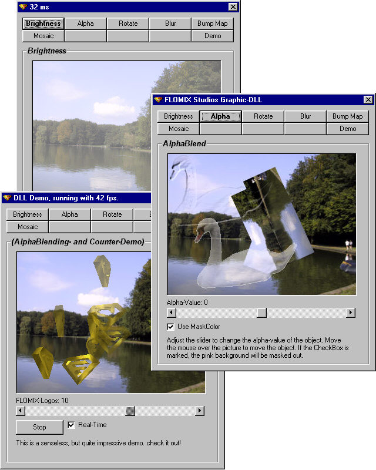



## Advanced Graphics Routines 2\.2 UPDATED  \*\*must see\!\*\*

### Description

If you want to adjust the brightness of a picture, rotate a picture with ANTI-ALIASING or AlphaBlend pictures together, maybe using an invisible mask color, and all that in vb and in just milliseconds... then you need this code! I wrote all the calculations in a C++ DLL, because it is much faster and easier to use, you just need a few lines of code to make incredible effects! in the zip-file there is the DLL and a VB-Demo to demonstrate the possibilities and the performance of my dll. 

 

NOTE: Version 3.0 is released, go to http://www.planet-source-code.com/vb/scripts/showcode.asp?txtCodeId=21470 

 

UPDATED! 2.0: The new package now also includes a VB-Only-Version with the functions from the dll rewritten for VB, so you can use the stuff without the dll! (though the dll is faster than the still fast VB-code, so i would use the dll). I also included a BUMP MAPPING routine a BLUR filter and an IMPROVED ALPHA BLENDING routine. 

 

UPDATED! 2.1: Fixed a problem with 16 bit color depth. included MOSAIC filter. 

 

UPDATED! 2.2: Added some nice, useful timer- and counter-functions. See demo for description. I Also added a complete DOCUMENTATION of all functions with descriptions of all parameters to help you using my code (see "readme.txt").

 

 Test it and *please* vote for this really useful and good piece of code! 

 

NOTE: Version 3.0 is released, go to <a href='http://www.planet-source-code.com/vb/scripts/showcode.asp?txtCodeId=21470'>http://www.planet-source-code.com/vb/scripts/showcode.asp?txtCodeId=21470 
 
### More Info
 

             |
---                |---
**Submitted On**   |2001-02-20 18:32:44
**By**             |[Florian Egel](https://github.com/Planet-Source-Code/PSCIndex/blob/master/ByAuthor/florian-egel.md)
**Level**          |Intermediate
**User Rating**    |5.0 (284 globes from 57 users)
**Compatibility**  |VB 4\.0 \(32\-bit\), VB 5\.0, VB 6\.0
**Category**       |[Graphics](https://github.com/Planet-Source-Code/PSCIndex/blob/master/ByCategory/graphics__1-46.md)
**World**          |[Visual Basic](https://github.com/Planet-Source-Code/PSCIndex/blob/master/ByWorld/visual-basic.md)
**Archive File**   |[CODE\_UPLOAD152472202001\.zip](https://github.com/Planet-Source-Code/florian-egel-advanced-graphics-routines-2-2-updated-must-see__1-21105/archive/master.zip)

